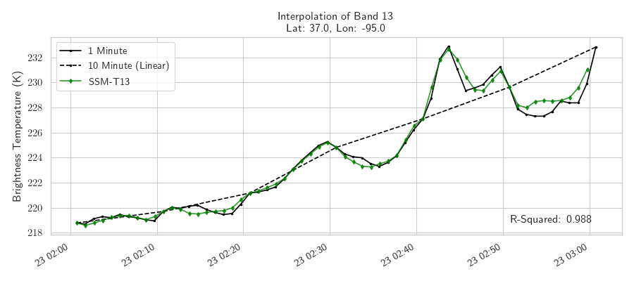

# Geostationary Temporal Interpolation with Optical Flow

Depends on GOES-R series Geostationary Satellite data and retreived from public datasets by NOAA hosted on AWS.  Trains and tests on mesoscale 1-minute observations to perform interpolation of 5- and 10-minute large scale observations.

Click for Video 

## Dependencies

`conda env create -f environment.yaml`

Ensure your AWS S3 aws_access_key and aws_secret_access_key are set. 

## Download data and/or read from NAS

The files `data/noaas3.py` and `data/goesr.py` contains two classes and functions to download and process training and test datsets.

`NOAAGOESS3`: Connects to NOAAs AWS S3 bucket to download data locally, read the files accordingly, and generate pytorch examples. This should be split into two classes, one that downloads the data and other that reads the local files.  
`GOESDataset`: Pytorch dataset object for training. 

`download_data(test, n_jobs)`: Downloads training and test data.  Every 5 days of 2017 and 2018 for training and 2019 for testing. 

By default, this script will download train and test datasets as needed. Currently the local data directory needs to be updated for your system (this needs to be fixed).  
Run `python data/noaas3.py`

## Make training patches (years 2017, 2018)

Generating training patches from the raw data is done in parallel on a single node with the script `python data/training_data.py` or by submitting an mpi job.  

## Perform Bayesian Optimization to find Hyper-parameters

Bayesian Optimization is used to select hyperparameters using the Ax library and Pytorch. `experiments/parameter_search.py` will find hyper-parameters for a specified set of channels, `n_channels`, and single- or multi-variate, `multivariate`. Multiple experiments can be ran in parallel on NAS's v100 queue on sky_gpu using the pbs script `./mpi.bayesopt_training.pbs`. 

## Training models and experiments

`train_interpolation.py` contains the base training methods for interpolation model, include the flow and interpolation convolutional neural networks. 

Experiments can be found in `experiments/` where we perform individual training on each model, including bayesian hyperparameter search. 

@TODO: Create a persistent link to trained model weights. 

## Performing Interpolation

See objects defined in `interpolation.py` that is used for defining the interpolation model based on pre-trained weights. 

For usage, see code in `scripts/` and `notebooks/`. 

## Acknowledgements

This work was supported by the NASA Earth eXchange (NEX) and under the NASA ROSES grant 19-ESROGSS-19-0123. We would like to thank the GOES-R data providers for access to GOES-16 mesoscale and full-disk observations. NASA's Advanced Supercomputing facility at Ames Research Center was used for accelerated computing with Nvidia V100 GPUs.
